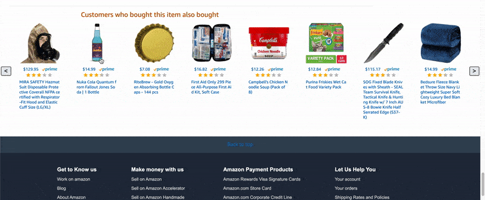

# Gammazon - Carousel Component
Gammazon is an Amazon Product Page replica. This component consists of the product recommendation carousel microserver of Gammazon.

## In Action

  
## Table of Contents
1. [UserStories](#userstories)
2. [Stack](#stack)
3. [GetStarted](#getstarted)
4. [Reflections](#reflections)
6. [Contributors](#contributors)
7. [RelatedProjects](#relatedprojects)

## UserStories
- As a user, I want to view 8 items that are related to the current product that I am viewing.
- As a user, I want to render the previous/next 8 items if I click the left/right arrow button.
- As a user, I want to know the name, price, rating, and elibitility for prime delivery for each item.
- As a user, I want to navigate to the product page of the item if I click any of the item-related components within the carousel.

# Stack

<table>
  <tr>
  </tr>
  <tr>
    <td align="center">Front-end</td>
    <td align="center">Back-end</td>
    <td align="center">Deployment</td>
  </tr>
  <tr>
    <td align="center"></td>
    <td align="center"></td>
    <td align="center"></td>
  </tr>
  <tr>
    <td align="center"></td>
    <td align="center"></td>
    <td align="center"></td>
  </tr>
  <tr>
  <td align="center"></td>
    <td align="center"></td>
    <td align="center"></td>
  </tr>
  <tr>
  <td align="center"></td>
    <td align="center"></td>
    <td align="center"></td>
  </tr>
</table>

## Front-End
The carousel microservice utilized ReactJS on the front-end.

## Back-End 
Product information was stored in a MySQL database. Express RESTful APIs are used to enter and retrieve data. Product images were stored in AWS S3.

## Deployment
Docker images were generated to deploy the microservice on AWS Elastic Beanstalk. The MySQL database for the component was hosted on AWS RDS.

* This microservice is not currently deployed

## Requirements
- Node 6.13.0
- etc

# GetStarted
Take the following steps to run the app in your localhost, you will need to have the following:
- A MySQL database must be set up, and the appropriate credentials must be added to the config.js file.

From terminal in the index folder:
```
npm install
npm start
npm run react-dev
```

# Reflections

## Challenges
This project was focused on exercising my front-end skills with raw CSS. As part of a team of 5, the end product was for the full-stack carousel microservice to be incorporated into a proxy server and deployed to complete the Gammazon product page.

## Learnings
I was able to hone my competency with CSS FlexBox, and soldified my grasp on ReactJS. Furthermore, I learned to deploy my microservice and proxyserver using a combination of Docker and AWS Elastic Beanstalk. Multiple AWS services including S3 and RDS were learned to implement the app.

## Contributors
- Carousel and Display - [Benjamin Hong](https://github.com/bhong35)
- Shopping Cart - [Kytra Murphree](https://github.com/KytraScript)
- Product Description - [Sam Lawson](https://github.com/samlawson355)
- Reviews - [Tim Sanderson](https://github.com/timsand)
- Top and Bottom Bar - [Matt Lucas](https://github.com/mlucas24)

## RelatedProjects
  - https://github.com/Gammazon/feature-carousel
  - https://github.com/Gammazon/feature-display
  - https://github.com/Gammazon/Feature-Bottom-bar
  - https://github.com/Gammazon/Feature-Top-Bar
  - https://github.com/Gammazon/product-description
  - https://github.com/Gammazon/featureReviews
  - https://github.com/Gammazon/BenProxy